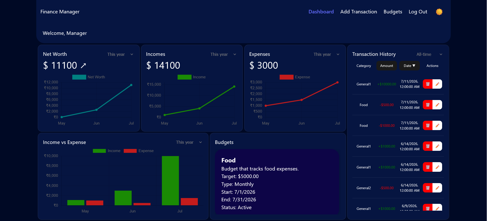
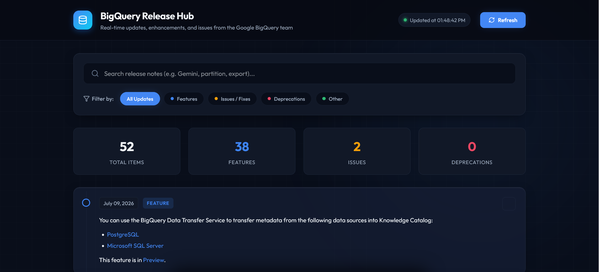

  <h1>Hi there! I'm Govardhan Gopu 👋</h1>
  <h3>Full Stack Developer & AI Agent Engineer</h3>
  
Building high-fidelity web experiences, secure backends, and autonomous agent loops.

  
  
  
  

---

### 💫 About Me

I am a dedicated software developer specializing in building modern, performant web applications. My engineering philosophy combines visual excellence with robust architectures, security assertions, and clean data modeling.

* 🤖 **AI Agent Systems:** Designing autonomous Reasoning-Action loops utilizing the **Google GenAI SDK**, tool/function calling patterns, and prompt injection gates.
* 💻 **Full-Stack Engineering:** Integrating interactive **React.js** frontends with performant **Node.js (Express)** backends and optimized **MySQL** database schemas.

---

### 🛠️ Core Stack & Technologies

| Layer | Technologies & Badges |
| :--- | :--- |
| **Languages** | `JavaScript` `Python` `SQL` `HTML5` `CSS3` |
| **Frameworks & Libraries** | `Node.js` `Express` `React.js` `Flask` |
| **AI Systems** | `Google GenAI SDK` `Reasoning-Action Loops` `Tool Calling` |
| **Databases & Tools** | `MySQL` `Git` `Vercel` `JWT` |

 

| Domain | Specialized Expertise |
| :--- | :--- |
| **AI logic** | Google GenAI SDK, Structured Function Calling, Prompt Gating, Threat Modeling |
| **Frontend** | React.js, Responsive CSS layouts, Vanilla Animations, Recharts charts, Lucide Icons |
| **Backend** | Express REST endpoints, RESTful API design, JWT validation headers, CORS configuration |
| **Databases** | Relational Schemas, Complex SQL joins, Transaction isolation, Database normalization |

---

### 📊 Live GitHub Activity Stats
*Dynamic stats customized to load a dark themed layout matching your portfolio, or a high-contrast light layout based on user system settings.*

<table align="center" border="0" cellpadding="8" cellspacing="0">
  <tr>
    <td valign="top" align="center">
      <a href="https://github.com/govardhangopu">
        <picture>
          <source media="(prefers-color-scheme: dark)" srcset="https://github-stats-extended.vercel.app/api?username=govardhangopu&show_icons=true&bg_color=090e1a&title_color=22d3ee&text_color=cbd5e1&icon_color=c084fc&border_color=22d3ee30&rank_icon=github" />
          <source media="(prefers-color-scheme: light)" srcset="https://github-stats-extended.vercel.app/api?username=govardhangopu&show_icons=true&bg_color=ffffff&title_color=0f172a&text_color=334155&icon_color=4f46e5&border_color=e2e8f0&rank_icon=github" />
          
        </picture>
      </a>
    </td>
    <td valign="top" align="center">
      <a href="https://github.com/govardhangopu">
        <picture>
          <source media="(prefers-color-scheme: dark)" srcset="https://github-stats-extended.vercel.app/api/top-langs?username=govardhangopu&bg_color=090e1a&title_color=22d3ee&text_color=cbd5e1&icon_color=c084fc&border_color=22d3ee30&langs_count=6" />
          <source media="(prefers-color-scheme: light)" srcset="https://github-stats-extended.vercel.app/api/top-langs?username=govardhangopu&bg_color=ffffff&title_color=0f172a&text_color=334155&icon_color=4f46e5&border_color=e2e8f0&langs_count=6" />
          
        </picture>
      </a>
    </td>
  </tr>
  <tr>
    <td colspan="2" align="center" valign="top">
      <a href="https://github.com/govardhangopu">
        <picture>
          <source media="(prefers-color-scheme: dark)" srcset="https://streak-stats.demolab.com?user=govardhangopu&background=090e1a&border=22d3ee30&stroke=cbd5e1&ring=22d3ee&fire=c084fc&currStreakNum=22d3ee&currStreakLabel=cbd5e1&sideNums=cbd5e1&sideLabels=cbd5e1&dates=c084fc" />
          <source media="(prefers-color-scheme: light)" srcset="https://streak-stats.demolab.com?user=govardhangopu&background=ffffff&border=e2e8f0&stroke=334155&ring=4f46e5&fire=ea580c&currStreakNum=4f46e5&currStreakLabel=334155&sideNums=334155&sideLabels=475569&dates=4f46e5" />
          
        </picture>
      </a>
    </td>
  </tr>
</table>

---

### 🚀 Highlighted Projects

#### 🤖 [Smart Expense Assistant](https://github.com/govardhangopu/smart-expense-assistant)
* **Description:** An autonomous, single-file Node.js AI agent command-line tool. Connects a model reasoning loop to a local JSON database using structured tools and function-calling schemas.
* **Repository:** [GitHub Code Link](https://github.com/govardhangopu/smart-expense-assistant)
* **Tech:** `Node.js`, `Google GenAI SDK`, `Readline CLI`, `Threat Gating`, `Dotenv`
* **Key Feature:** Robust security filters that reject payload prompt injections (over 200 characters) and logic checks denying negative amounts or overflows.

#### 💳 [Finance Manager](https://github.com/govardhangopu/FinanceManager)
* **Description:** A full-stack financial planner allowing users to input transactions, set budgeting thresholds, and run simulated future cost scenarios.
* **Repository:** [GitHub Code Link](https://github.com/govardhangopu/FinanceManager)
* **Demo:** [Check it out here](https://financemanager-opal.vercel.app/)
* **Tech:** `React.js`, `Node.js`, `Express`, `MySQL`, `JWT Auth`, `Recharts`
* **Key Feature:** Multi-budget tracking coupled with simulated sandbox modules to preview structural budgeting decisions.
 

  

#### 📈 [Event Talks App](https://github.com/govardhangopu/event-talks-app)
* **Description:** A real-time BigQuery release notes parser that crawls official Google XML streams and offers client-side search summaries and Twitter composing integrations.
* **Repository:** [GitHub Code Link](https://github.com/govardhangopu/event-talks-app)
* **Demo:** [Check it out here](https://event-talks-app-nine.vercel.app/)
* **Tech:** `Python`, `Flask`, `XML Parsing`, `Vanilla JS`, `Vanilla CSS`
* **Key Feature:** Split-drawer tweet composer with native character counting logic mimicking real Twitter API constraints.
 

  

---

  Let's collaborate! Feel free to reach out via <a href="https://www.linkedin.com/in/govardhangopu/" target="_blank" rel="noopener noreferrer">LinkedIn</a> or check out my <a href="https://govardhangopu.vercel.app/" target="_blank" rel="noopener noreferrer">Portfolio</a>.

